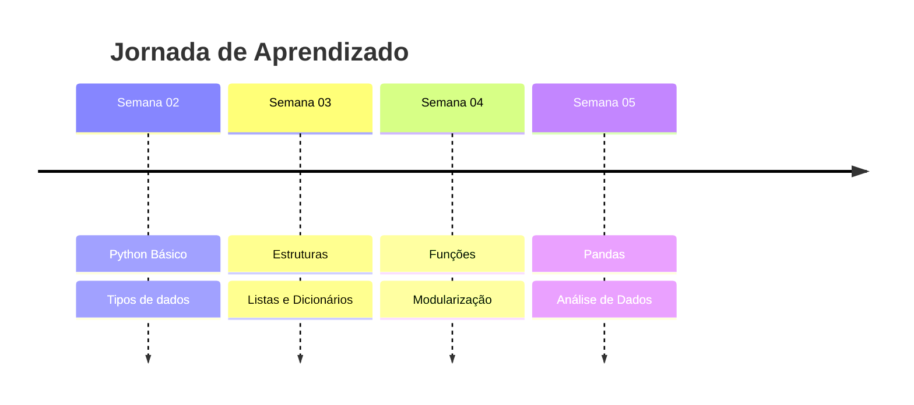
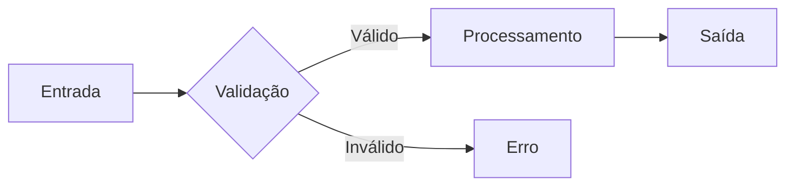

# 🎨 Guia de Melhorias para o Portfólio GitHub

## 📋 Índice
1. [Badges e Shields](#badges-e-shields)
2. [Screenshots e Imagens](#screenshots-e-imagens)
3. [Estrutura Visual](#estrutura-visual)
4. [GitHub Profile README](#github-profile-readme)
5. [Documentação de Código](#documentação-de-código)
6. [Próximos Passos](#próximos-passos)

---

## 🏆 1. Badges e Shields

### ✅ **Já Implementado no README Principal**

Badges de tecnologias:
```markdown


```

### 🔮 **Sugestões Adicionais**

#### **Status Badges (Dinâmicos)**
```markdown
[](https://github.com/augustocosta-17/analise-de-dados-devinhouse)
[](https://github.com/augustocosta-17/analise-de-dados-devinhouse)
[](https://github.com/augustocosta-17/analise-de-dados-devinhouse)
```

#### **Progress Badges (Personalizados)**
```markdown


```

#### **Badges de Skills**
```markdown

```

### 🌐 **Geradores de Badges**

- **Shields.io:** https://shields.io/
- **Badgen:** https://badgen.net/
- **For the Badge:** https://forthebadge.com/
- **Simple Badges:** https://badges.pages.dev/

---

## 📸 2. Screenshots e Imagens

### 🎯 **Por Que Adicionar Screenshots?**

✅ **Demonstra** que o código funciona  
✅ **Visualização** rápida do projeto  
✅ **Profissionalismo** - Mostra atenção aos detalhes  
✅ **Diferencial** - Poucos estudantes fazem isso  

### 📷 **Como Capturar Screenshots**

#### **Opção 1: Windows Snipping Tool**
```
1. Abra o programa
2. Windows + Shift + S
3. Selecione a área
4. Salve a imagem
```

#### **Opção 2: Print Screen no VS Code**
```
1. Execute o código no terminal
2. Capture a saída
3. Salve em /screenshots/
```

#### **Opção 3: Ferramentas Profissionais**
- **Carbon:** https://carbon.now.sh/ (código bonito)
- **Snagit:** Capturas profissionais
- **ShareX:** Gratuito e poderoso

### 📁 **Estrutura de Pastas para Imagens**

```
modulo_01_programacao_e_modelagem_de_dados/
└── semana_02/
    ├── screenshots/
    │   ├── conversor_temperatura_exemplo1.png
    │   ├── conversor_temperatura_exemplo2.png
    │   ├── jogo_adivinhacao_vitoria.png
    │   └── verificador_tipo_demo.png
    ├── conversor_de_temperatura.py
    ├── jogo_adivinhacao.py
    └── README.md
```

### 🖼️ **Como Adicionar no README**

#### **Método 1: Imagem Simples**
```markdown

```

#### **Método 2: Imagem com Link**
```markdown
[](./jogo_adivinhacao.py)
```

#### **Método 3: Imagem Centralizada**
```markdown
<div align="center">
  
  <p><i>Figura 1: Execução do Conversor de Temperatura</i></p>
</div>
```

#### **Método 4: Comparação Lado a Lado**
```markdown
<table>
<tr>
<td></td>
<td></td>
</tr>
<tr>
<td align="center"><b>Input do Usuário</b></td>
<td align="center"><b>Saída do Programa</b></td>
</tr>
</table>
```

### 🎨 **Criando Screenshots Bonitas**

#### **Para Código: Carbon**
```
1. Acesse: https://carbon.now.sh/
2. Cole seu código
3. Escolha tema (ex: Dracula, Nord)
4. Exporte como PNG
5. Use no README
```

**Exemplo:**
```markdown

```

#### **Para Terminal: Asciinema**
```
1. Grave a execução: asciinema rec demo.cast
2. Faça upload: asciinema upload demo.cast
3. Adicione no README
```

---

## 🎨 3. Estrutura Visual Melhorada

### ✅ **Técnicas Implementadas**

#### **Seções Expansíveis (Details)**
```markdown
<details>
<summary><b>📖 Clique para ver detalhes</b></summary>

Conteúdo oculto até clicar...

</details>
```

#### **Tabelas para Organização**
```markdown
| Coluna 1 | Coluna 2 | Coluna 3 |
|----------|----------|----------|
| Dado 1   | Dado 2   | Dado 3   |
```

#### **Alinhamento Central**
```markdown
<div align="center">
  Conteúdo centralizado
</div>
```

#### **Emojis Estratégicos**
```markdown
✅ ❌ 🎯 📊 💡 🚀 📝 🔧 📚 💻
```

### 🔮 **Novas Sugestões**

#### **Progress Bars**
```markdown
**Progresso do Curso:**

Python Básico     ████████████████████ 100%
Pandas            ████████░░░░░░░░░░░░  40%
SQL               ██░░░░░░░░░░░░░░░░░░  10%
Power BI          ░░░░░░░░░░░░░░░░░░░░   0%
```

#### **Cards de Projeto**
```markdown
<table>
<tr>
<td width="50%">

### 🎲 Jogo de Adivinhação


Sistema interativo de jogo com:
- Dicas inteligentes
- Contador de tentativas
- Sistema de replay

[Ver código →](./jogo.py)

</td>
<td width="50%">

### 🌡️ Conversor de Temperatura


Conversão entre escalas:
- Celsius ↔ Fahrenheit
- Celsius ↔ Kelvin
- Validação de entrada

[Ver código →](./conversor.py)

</td>
</tr>
</table>
```

#### **Timeline Visual**
```markdown
## 📅 Timeline do Aprendizado


\```
```

#### **Diagramas (Mermaid)**
```markdown

\```
```

---

## 👤 4. GitHub Profile README

### 🎯 **Criar README do Perfil**

1. Crie repositório: `augustocosta-17`
2. Adicione arquivo: `README.md`
3. Este README aparece no seu perfil!

### 🌟 **Template Sugerido**

```markdown
# Olá! Eu sou Augusto 👋

## 🚀 Sobre Mim
🎓 Estudante de Análise de Dados  
💼 Futuro Data Analyst  
📊 Apaixonado por transformar dados em insights  

## 🛠️ Tecnologias


## 📊 GitHub Stats


## 🔥 Streak


## 📂 Projetos Principais
- 📊 [Análise de Dados - DevInHouse](https://github.com/augustocosta-17/analise-de-dados-devinhouse)

## 📫 Contato
[](https://linkedin.com)
[](mailto:augustoccostamg@gmail.com)
```

### 🎨 **Ferramentas para Profile README**

- **GitHub Stats:** https://github.com/anuraghazra/github-readme-stats
- **Streak Stats:** https://github.com/DenverCoder1/github-readme-streak-stats
- **Trophy:** https://github.com/ryo-ma/github-profile-trophy
- **Skills Icons:** https://github.com/tandpfun/skill-icons
- **Typing SVG:** https://github.com/DenverCoder1/readme-typing-svg

---

## 💻 5. Documentação de Código

### ✅ **Docstrings em Python**

```python
def converter_temperatura(valor, origem, destino):
    """
    Converte temperatura entre diferentes escalas.
    
    Args:
        valor (float): Valor da temperatura a ser convertida
        origem (str): Escala de origem ('C', 'F', 'K')
        destino (str): Escala de destino ('C', 'F', 'K')
    
    Returns:
        float: Temperatura convertida
    
    Example:
        >>> converter_temperatura(25, 'C', 'F')
        77.0
    
    Raises:
        ValueError: Se a escala for inválida
    """
    # código...
```

### 📝 **Comentários Estratégicos**

```python
# ✅ BOM: Explica o "porquê"
# Usar dicionário para melhor performance em lookups
cache = {}

# ❌ RUIM: Explica o óbvio
# Incrementa i em 1
i += 1
```

### 📖 **README no Diretório do Projeto**

Cada projeto grande pode ter seu próprio README:

```
semana_05/
└── Trello/
    └── devinhouse-semana5-notebook/
        ├── README.md ← JÁ TEM! ✅
        ├── clientes.csv
        └── devinhouse-semana5.ipynb
```

---

## 🚀 6. Próximos Passos (Roadmap)

### ✅ **Implementado**
- [x] README principal com badges
- [x] Estrutura hierárquica clara
- [x] Documentação por módulo/semana
- [x] Links de navegação

### 🔄 **Em Progresso**
- [ ] Adicionar screenshots em todos exercícios
- [ ] Criar GitHub Profile README
- [ ] Adicionar diagramas com Mermaid
- [ ] Documentar código com docstrings

### 🔮 **Futuro**
- [ ] GitHub Actions para CI/CD
- [ ] Testes automatizados
- [ ] Badges de cobertura de testes
- [ ] GitHub Pages para documentação
- [ ] Vídeos demonstrativos (YouTube)

---

## 📊 7. Checklist de Qualidade

### **Para Cada Semana:**

```markdown
- [ ] README completo
- [ ] Screenshots dos exercícios principais (mínimo 2)
- [ ] Código comentado
- [ ] Docstrings em funções
- [ ] Exemplo de execução
- [ ] Links de navegação (anterior/próxima)
- [ ] Lista de conceitos aprendidos
- [ ] Estatísticas (horas, LOC, etc.)
```

### **Para Cada Projeto Destaque:**

```markdown
- [ ] README próprio
- [ ] Screenshots do resultado
- [ ] Diagrama de fluxo (se aplicável)
- [ ] Como executar
- [ ] Dependências listadas
- [ ] Exemplos de uso
- [ ] Insights/aprendizados
```

---

## 🎯 8. Prioridades (Ordem de Implementação)

### **🔥 Alta Prioridade (Fazer Agora)**
1. ✅ Finalizar README principal (FEITO!)
2. 📸 Tirar screenshots de 3-5 projetos principais
3. 👤 Criar GitHub Profile README
4. 🔗 Adicionar link do LinkedIn no perfil

### **⚡ Média Prioridade (Esta Semana)**
5. 📝 Adicionar docstrings nos códigos principais
6. 🎨 Criar 2-3 diagramas com Mermaid
7. 📊 Atualizar estatísticas semanalmente
8. 🖼️ Usar Carbon para código bonito

### **💡 Baixa Prioridade (Quando Tiver Tempo)**
9. 🎥 Gravar vídeos demo (opcional)
10. 🌐 GitHub Pages (avançado)
11. 🧪 Testes automatizados
12. 📈 Analytics do repositório

---

## 💎 9. Exemplos de Repositórios Inspiradores

### **Portfólios de Análise de Dados:**

- [Awesome Data Science](https://github.com/academic/awesome-datascience)
- [Data Science Portfolio](https://github.com/sajal2692/data-science-portfolio)
- [Python Data Science Handbook](https://github.com/jakevdp/PythonDataScienceHandbook)

### **READMEs Bem Feitos:**

- [Best README Template](https://github.com/othneildrew/Best-README-Template)
- [Awesome README](https://github.com/matiassingers/awesome-readme)

---

## 🎨 10. Templates Prontos para Usar

### **Template: Novo Exercício**

```markdown
### 🎯 **[Nome do Exercício]** - [`arquivo.py`](./arquivo.py)

<details>
<summary><b>📖 Ver Detalhes</b></summary>

**Descrição:**
[O que o exercício faz]

**Conceitos:**
- ✅ Conceito 1
- ✅ Conceito 2

**Como Executar:**
\```bash
python arquivo.py
\```

**Screenshot:**


</details>
```

### **Template: Projeto Completo**

```markdown
# 🚀 [Nome do Projeto]


## 📝 Sobre
[Descrição breve]

## 🎯 Objetivos
- Objetivo 1
- Objetivo 2

## 🛠️ Tecnologias
- Python 3.x
- Pandas
- NumPy

## 📸 Screenshots
[Imagens]

## 🚀 Como Executar
\```bash
python main.py
\```

## 📊 Resultados
[Insights obtidos]

## 🎓 Aprendizados
[O que aprendi]
```

---

## ✨ Conclusão

Com essas melhorias, seu portfólio ficará:
- 🏆 **Profissional** - Visual atraente
- 📊 **Completo** - Screenshots e diagramas
- 🎯 **Organizado** - Estrutura clara
- 💼 **Impressionante** - Destaque entre candidatos

**Próximo passo:** Comece tirando screenshots dos projetos principais! 📸

