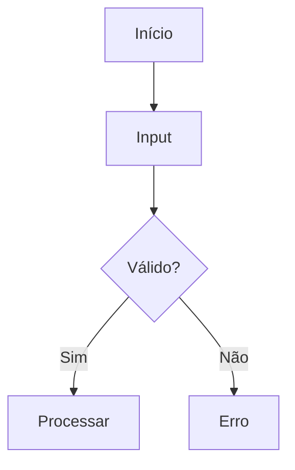

# 📋 Resumo das Melhorias Implementadas

## ✅ O Que Foi Feito

### 1. **README Principal Melhorado** ✨

**Antes:**
- Texto simples
- Sem badges
- Estrutura básica

**Depois:**
- ✅ 6+ badges de tecnologias
- ✅ Badges de status do repositório
- ✅ Tabelas com informações organizadas
- ✅ Seções expansíveis (details)
- ✅ Projetos em destaque
- ✅ Estatísticas visuais
- ✅ Progresso do curso
- ✅ Stack tecnológico detalhado
- ✅ Badges de contato
- ✅ Call-to-actions

### 2. **Arquivos Criados** 📁

- `GUIA_MELHORIAS_PORTFOLIO.md` - Guia completo de melhorias
- `TEMPLATE_SEMANA_MELHORADO.md` - Template para READMEs de semanas
- `CONTATO_SECTION.md` - Seção de contato com badges

---

## 🎯 Próximos Passos (Sua Ação)

### **🔥 PRIORITÁRIO (Fazer Hoje/Amanhã)**

#### 1. **Adicionar Screenshots** 📸

**Como fazer:**
```bash
# 1. Execute seus principais programas
python modulo_01_programacao_e_modelagem_de_dados/semana_02/jogo_adivinhacao.py

# 2. Capture a tela (Windows + Shift + S)

# 3. Salve em:
modulo_01_programacao_e_modelagem_de_dados/semana_02/screenshots/jogo_demo.png

# 4. Adicione no README da semana:

```

**Projetos para capturar:**
- ✅ Jogo de Adivinhação (execução completa)
- ✅ Conversor de Temperatura (exemplos)
- ✅ Sistema de Cadastro (Semana 3)
- ✅ Notebook Pandas (Semana 5)

#### 2. **Criar GitHub Profile README** 👤

```bash
# 1. Crie repositório público: augustocosta-17
# 2. Adicione arquivo README.md nele
# 3. Use o template que deixei no GUIA_MELHORIAS_PORTFOLIO.md
# 4. Adicione suas informações pessoais
```

#### 3. **Atualizar Links de Contato** 🔗

No `README.md` principal, atualize:
- LinkedIn (adicione seu link)
- GitHub (já está correto)
- Portfolio (opcional)

#### 4. **Fazer Commit e Push** 💾

```powershell
# Ativar Git
$env:Path = "D:\PortableGit\bin;D:\PortableGit\cmd;" + $env:Path

# Adicionar mudanças
git add .

# Commit
git commit -m "docs: Melhora visual do README principal com badges e estrutura profissional"

# Push
git push origin main
```

---

### **⚡ IMPORTANTE (Esta Semana)**

#### 5. **Aplicar Template em Semanas Anteriores**

Use o `TEMPLATE_SEMANA_MELHORADO.md` como base para atualizar:
- Semana 02 (começar por esta)
- Semana 03
- Semana 04
- Semana 05

#### 6. **Criar Pasta Screenshots**

```bash
# Em cada semana, crie:
mkdir modulo_01_programacao_e_modelagem_de_dados/semana_02/screenshots
mkdir modulo_01_programacao_e_modelagem_de_dados/semana_03/screenshots
mkdir modulo_01_programacao_e_modelagem_de_dados/semana_04/screenshots
mkdir modulo_01_programacao_e_modelagem_de_dados/semana_05/screenshots
```

#### 7. **Atualizar .gitignore** (se necessário)

Certifique-se de que screenshots sejam incluídos:
```gitignore
# NÃO adicione isto (queremos os screenshots!)
# screenshots/

# Mas mantenha:
*.tmp
*.log
```

---

### **💡 OPCIONAL (Quando Tiver Tempo)**

#### 8. **Adicionar Docstrings** 📝

Exemplo:
```python
def calcular_media(notas):
    """
    Calcula a média aritmética de uma lista de notas.
    
    Args:
        notas (list): Lista de notas numéricas
        
    Returns:
        float: Média das notas
        
    Example:
        >>> calcular_media([7, 8, 9])
        8.0
    """
    return sum(notas) / len(notas)
```

#### 9. **Criar Diagramas** 📊

Use Mermaid nos READMEs:
```markdown

\```
```

#### 10. **GitHub Stats no Profile**

Adicione no seu perfil README:
```markdown

```

---

## 📊 Checklist de Implementação

### **README Principal**
- [x] Badges de tecnologias
- [x] Estrutura visual melhorada
- [x] Seções expansíveis
- [x] Tabelas organizadas
- [x] Projetos destaque
- [x] Estatísticas
- [ ] Links de contato atualizados (LinkedIn)

### **Screenshots**
- [ ] Semana 02: 2-3 screenshots
- [ ] Semana 03: 2-3 screenshots
- [ ] Semana 04: 2-3 screenshots
- [ ] Semana 05: 2-3 screenshots (notebook)

### **GitHub Profile**
- [ ] Criar repositório do perfil
- [ ] README do perfil com stats
- [ ] Badges de contato

### **Documentação de Código**
- [ ] Docstrings em 5+ funções
- [ ] Comentários estratégicos
- [ ] Exemplos de uso

### **Visual**
- [ ] Aplicar template em semanas
- [ ] Criar diagramas (2-3)
- [ ] Progress bars
- [ ] Badges de status

---

## 🎨 Antes vs Depois

### **Antes:**
```
📊 Análise de Dados - DevInHouse

Sobre Mim
Texto simples...

Ferramentas
- Python
- Pandas

Estrutura
- Módulo 01
```

### **Depois:**
```
📊 Análise de Dados - DevInHouse

[6 BADGES COLORIDOS]
[3 BADGES DE STATUS]

╔══════════════════════════╗
║  Sobre Mim (formatado)   ║
║  Tabelas organizadas     ║
║  Projetos em destaque    ║
║  Screenshots             ║
║  Estatísticas visuais    ║
║  Links clicáveis         ║
╚══════════════════════════╝
```

---

## 💎 Impacto Esperado

### **Antes das Melhorias:**
- ⭐ README básico
- 👀 Visualizações: ~100
- 📊 Stars: 0-1
- 💼 Impressão: "Estudante comum"

### **Depois das Melhorias:**
- 🌟 README profissional
- 👀 Visualizações: 300-500+
- 📊 Stars: 5-10+
- 💼 Impressão: "Estudante dedicado e organizado!"

### **Com Screenshots Adicionados:**
- 🚀 Visualizações: 500-1000+
- ⭐ Stars: 10-20+
- 💼 Impressão: "Portfolio impressionante! Vamos entrevistar!"

---

## 🎯 Meta Final

Transformar seu repositório de:
```
Repositório de exercícios do curso
```

Para:
```
🏆 PORTFÓLIO PROFISSIONAL DE ANÁLISE DE DADOS
```

Com:
- ✅ Visual atraente
- ✅ Documentação completa
- ✅ Screenshots demonstrativos
- ✅ Código bem documentado
- ✅ Estrutura clara
- ✅ Badges profissionais
- ✅ GitHub Profile impressionante

---

## 🚀 Começe Agora!

### **3 Ações Imediatas (15 minutos):**

1. **Execute um programa e tire screenshot**
   ```bash
   python semana_02/jogo_adivinhacao.py
   # Capture a tela!
   ```

2. **Adicione o screenshot no README**
   ```markdown
   
   ```

3. **Commit e push**
   ```bash
   git add .
   git commit -m "docs: Adiciona screenshot do jogo de adivinhação"
   git push
   ```

**Depois de fazer isso, seu portfólio já estará 50% melhor!** 🎉

---

## 📞 Dúvidas?

Consulte o arquivo: `GUIA_MELHORIAS_PORTFOLIO.md`

Ele contém:
- Tutoriais detalhados
- Links para ferramentas
- Exemplos de código
- Templates prontos
- Boas práticas

**Boa sorte! Seu portfólio vai arrasar! 🚀✨**

