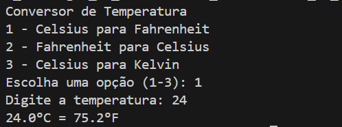
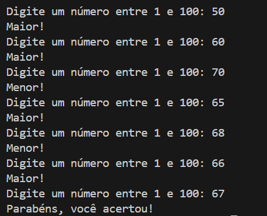
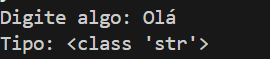

# 📂 Semana 02 - Fundamentos de Python

<div align="center">


</div>

---

## 🎯 Tema da Semana
Introdução à programação Python com foco em tipos de dados, estruturas condicionais, loops e desenvolvimento de pequenos programas interativos.

---

## 📋 Projetos e Exercícios

### 1. 🌡️ **Conversor de Temperatura** - [`conversor_de_temperatura.py`](./conversor_de_temperatura.py)

<details>
<summary><b>📖 Descrição e Conceitos</b></summary>

Programa que converte temperaturas entre diferentes escalas (Celsius, Fahrenheit, Kelvin).

**Conceitos Aplicados:**
- ✅ Input/Output
- ✅ Operações matemáticas
- ✅ Estruturas condicionais (if/elif/else)
- ✅ Formatação de strings

**Funcionalidades:**
- Conversão entre múltiplas escalas de temperatura
- Validação de entrada do usuário
- Interface interativa no terminal

</details>

<details>
<summary><b>📸 Screenshots & Execução</b></summary>

```bash
# Como executar
python conversor_de_temperatura.py
```



</details>

---

### 2. 🎲 **Jogo de Adivinhação** - [`jogo_adivinhacao.py`](./jogo_adivinhacao.py)

<details>
<summary><b>📖 Descrição e Conceitos</b></summary>

Jogo interativo onde o usuário tenta adivinhar um número gerado aleatoriamente.

**Conceitos Aplicados:**
- ✅ Loops (while)
- ✅ Condicionais aninhadas
- ✅ Biblioteca `random`
- ✅ Controle de fluxo
- ✅ Contadores e lógica de jogo

**Funcionalidades:**
- Geração de número aleatório
- Sistema de dicas (maior/menor)
- Contador de tentativas
- Loop de jogo contínuo

</details>

<details>
<summary><b>📸 Screenshots & Execução</b></summary>

```bash
# Como executar
python jogo_adivinhacao.py
```



</details>

---

### 3. 🔍 **Verificador de Tipo** - [`verificador_de_tipo.py`](./verificador_de_tipo.py)

<details>
<summary><b>📖 Descrição e Conceitos</b></summary>

Programa que identifica e valida tipos de dados em Python.

**Conceitos Aplicados:**
- ✅ Função `type()`
- ✅ Type checking
- ✅ Validação de entrada
- ✅ Conversão de tipos (casting)

</details>

<details>
<summary><b>📸 Screenshots & Execução</b></summary>

```bash
# Como executar
python verificador_de_tipo.py
```



</details>

---

### 4. 📝 **Exercícios de Aula** - [`aula_um/aula.py`](./aula_um/aula.py)

Exercícios práticos desenvolvidos durante a aula presencial.

---

## 💡 Conhecimentos Adquiridos

### **Fundamentos da Linguagem**

<table>
<tr>
<td width="50%">

**📌 Sintaxe Básica**
- ✅ Indentação obrigatória
- ✅ Comentários (`#` e `"""`)
- ✅ Variáveis e atribuições
- ✅ Print formatado

</td>
<td width="50%">

**📌 Tipos de Dados**
- ✅ `int` - Números inteiros
- ✅ `float` - Números decimais
- ✅ `str` - Strings (texto)
- ✅ `bool` - Booleanos (True/False)

</td>
</tr>
<tr>
<td>

**📌 Operadores**
- ✅ Aritméticos: `+`, `-`, `*`, `/`, `//`, `%`, `**`
- ✅ Relacionais: `==`, `!=`, `>`, `<`, `>=`, `<=`
- ✅ Lógicos: `and`, `or`, `not`

</td>
<td>

**📌 Estruturas de Controle**
- ✅ `if`, `elif`, `else`
- ✅ `for` loop
- ✅ `while` loop
- ✅ `break` e `continue`

</td>
</tr>
</table>

### **Funções Built-in Utilizadas**

```python
input()      # Recebe entrada do usuário
print()      # Exibe saída no console
type()       # Retorna o tipo de uma variável
len()        # Retorna o comprimento
range()      # Gera sequência de números
int()        # Converte para inteiro
float()      # Converte para decimal
str()        # Converte para string
```

### **Habilidades Práticas Desenvolvidas**
- 🎯 Receber e validar entrada do usuário
- 🎯 Implementar lógica condicional complexa
- 🎯 Criar loops para repetição de tarefas
- 🎯 Desenvolver programas interativos
- 🎯 Trabalhar com números aleatórios
- 🎯 Depuração básica de código

---

## 🛠️ Tecnologias e Bibliotecas


**Bibliotecas utilizadas:**
- `random` - Geração de números aleatórios

---

## 📊 Estatísticas da Semana

| Métrica | Valor |
|---------|-------|
| 📝 **Exercícios** | 4 |
| ⏱️ **Horas de Estudo** | ~8h |
| 💻 **Linhas de Código** | ~150 |
| 🎯 **Conceitos Aprendidos** | 15+ |

---

## 🎯 Desafios & Aprendizados

<details>
<summary><b>💪 Desafios Encontrados</b></summary>

- Entender a lógica de loops e condicionais
- Trabalhar com validação de entrada do usuário
- Debugging de erros de sintaxe e lógica
- Compreender o conceito de escopo de variáveis

</details>

<details>
<summary><b>🌟 Principais Aprendizados</b></summary>

- A importância da indentação correta em Python
- Como estruturar programas de forma lógica
- Pensar de forma algorítmica para resolver problemas
- O poder da simplicidade do Python para iniciantes

</details>

---

## 🎓 Próximos Passos

Na **Semana 03**, avançaremos para estruturas de dados mais complexas:
- 📚 Listas e suas operações
- 📦 Tuplas e imutabilidade
- 📖 Dicionários (chave-valor)
- 🔄 List comprehensions

---

## 📚 Recursos Adicionais

- 📖 [Documentação oficial Python](https://docs.python.org/pt-br/3/)
- 🎥 [Python para Iniciantes](https://www.youtube.com/results?search_query=python+para+iniciantes)
- 📝 [Exercícios práticos - HackerRank](https://hackerrank.com/domains/python)

---

<div align="center">

[⬅️ Voltar ao Módulo 01](../README.md) | [Próxima Semana ➡️](../semana_03/README.md)

</div>
