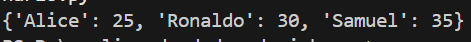
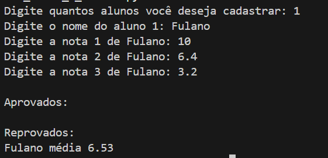
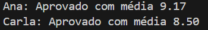
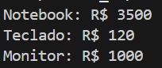
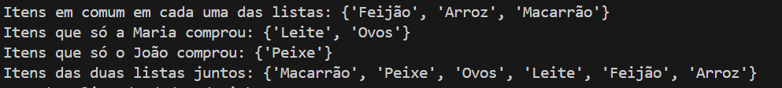
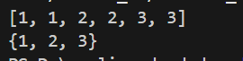
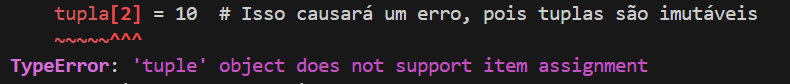

# 📂 Semana 03 - Estruturas de Dados

<div align="center">


</div>

---

## 🎯 Tema da Semana
Estruturas de dados avançadas em Python: listas, tuplas e dicionários. Manipulação, iteração e transformação de coleções de dados.

---

## 📋 Projetos e Exercícios

### 1. 🔄 **Conversor Lista para Dicionário** - [`conversor_lista_dicionario.py`](./conversor_lista_dicionario.py)

<details>
<summary><b>📖 Descrição e Conceitos</b></summary>

Programa que converte estruturas de listas em dicionários organizados.

**Conceitos Aplicados:**
- ✅ Listas
- ✅ Dicionários
- ✅ Transformação de dados
- ✅ Iteração sobre coleções

</details>

<details>
<summary><b>📸 Screenshots & Execução</b></summary>

```bash
python conversor_lista_dicionario.py
```



</details>

---

### 2. 📚 **Sistema de Cadastro de Notas e Alunos** - [`desafio_sistema_cadastro_notas_e_alunos.py`](./desafio_sistema_cadastro_notas_e_alunos.py)

<details>
<summary><b>📖 Descrição e Conceitos</b></summary>

Sistema completo para gerenciar cadastro de alunos e suas notas com operações CRUD.

**Conceitos Aplicados:**
- ✅ CRUD completo (Create, Read, Update, Delete)
- ✅ Dicionários aninhados
- ✅ Listas de dicionários
- ✅ Validação de dados
- ✅ Menu interativo

**Funcionalidades:**
- Cadastrar novos alunos
- Adicionar notas aos alunos
- Consultar notas individuais
- Calcular médias
- Atualizar informações
- Remover registros

**🏆 Destaque:** Projeto integrador da semana

</details>

<details>
<summary><b>📸 Screenshots & Execução</b></summary>

```bash
python desafio_sistema_cadastro_notas_e_alunos.py
```



</details>

---

### 3. 📊 **Dicionário de Notas** - [`dicionario_notas.py`](./dicionario_notas.py)

<details>
<summary><b>📖 Descrição e Conceitos</b></summary>

Gerenciamento de notas de estudantes usando dicionários.

**Conceitos Aplicados:**
- ✅ Dicionários
- ✅ Manipulação de dados estruturados
- ✅ Operações com chaves e valores

</details>

<details>
<summary><b>📸 Screenshots & Execução</b></summary>

```bash
python dicionario_notas.py
```



</details>

---

### 4. 🔍 **Filtro de Dicionário** - [`filtro_de_dicionario.py`](./filtro_de_dicionario.py)

<details>
<summary><b>📖 Descrição e Conceitos</b></summary>

Aplicação de filtros e buscas em estruturas de dicionários.

**Conceitos Aplicados:**
- ✅ Filtragem de dados
- ✅ Comprehensions
- ✅ Condicionais em estruturas de dados
- ✅ Busca e seleção

</details>

<details>
<summary><b>📸 Screenshots & Execução</b></summary>

```bash
python filtro_de_dicionario.py
```



</details>

---

### 5. 🛒 **Lista de Compras** - [`lista_compras.py`](./lista_compras.py)

<details>
<summary><b>📖 Descrição e Conceitos</b></summary>

Sistema simples para gerenciar uma lista de compras.

**Conceitos Aplicados:**
- ✅ Listas
- ✅ Métodos: `append()`, `remove()`, `pop()`
- ✅ Operações CRUD básicas

</details>

<details>
<summary><b>📸 Screenshots & Execução</b></summary>

```bash
python lista_compras.py
```



</details>

---

### 6. 🔄 **Remoção de Duplicatas** - [`remocao_duplicatas.py`](./remocao_duplicatas.py)

<details>
<summary><b>📖 Descrição e Conceitos</b></summary>

Programa para identificar e remover itens duplicados em listas.

**Conceitos Aplicados:**
- ✅ Sets (conjuntos)
- ✅ Listas
- ✅ Conversão entre tipos
- ✅ Operações de conjunto

</details>

<details>
<summary><b>📸 Screenshots & Execução</b></summary>

```bash
python remocao_duplicatas.py
```



</details>

---

### 7. 📦 **Tupla Imutável** - [`tupla_imutavel.py`](./tupla_imutavel.py)

<details>
<summary><b>📖 Descrição e Conceitos</b></summary>

Exploração das características e uso de tuplas.

**Conceitos Aplicados:**
- ✅ Tuplas
- ✅ Imutabilidade
- ✅ Tuple unpacking
- ✅ Quando usar tuplas vs listas

</details>

<details>
<summary><b>📸 Screenshots & Execução</b></summary>

```bash
python tupla_imutavel.py
```



</details>

---

### 8. 📝 **Exercícios de Aula** - `M1S03_Aula 1/`

<details>
<summary><b>Ver exercícios da aula</b></summary>

- [`DesafioAulaIntervalo.py`](./M1S03_Aula%201/DesafioAulaIntervalo.py) - Desafio com ranges e intervalos
- [`Dicionario.py`](./M1S03_Aula%201/Dicionario.py) - Prática com dicionários
- [`Tuplas.py`](./M1S03_Aula%201/Tuplas.py) - Exercícios com tuplas

</details>

---

## 💡 Conhecimentos Adquiridos

### **Estruturas de Dados Python**

<table>
<tr>
<td width="33%">

**📚 Listas**
- ✅ Criação e inicialização
- ✅ Indexação e slicing
- ✅ Métodos: `append()`, `remove()`, `pop()`, `insert()`, `extend()`
- ✅ List comprehensions
- ✅ Iteração com loops

</td>
<td width="33%">

**📦 Tuplas**
- ✅ Imutabilidade
- ✅ Quando usar tuplas vs listas
- ✅ Tuple unpacking
- ✅ Operações básicas
- ✅ Performance

</td>
<td width="33%">

**📖 Dicionários**
- ✅ Estrutura chave-valor
- ✅ Métodos: `keys()`, `values()`, `items()`, `get()`
- ✅ Dicionários aninhados
- ✅ Dict comprehensions
- ✅ Iteração

</td>
</tr>
</table>

### **Operações Avançadas**

```python
# List comprehensions
quadrados = [x**2 for x in range(10)]

# Dict comprehensions
notas_dict = {aluno: nota for aluno, nota in zip(alunos, notas)}

# Sets para remoção de duplicatas
unicos = list(set(lista_com_duplicatas))

# Filtragem de dados
aprovados = [aluno for aluno in alunos if aluno['nota'] >= 7]
```

### **Conceitos CRUD**
- ✅ **Create** - Adicionar novos elementos
- ✅ **Read** - Consultar e exibir dados
- ✅ **Update** - Atualizar informações existentes
- ✅ **Delete** - Remover elementos

---

## 🛠️ Tecnologias e Bibliotecas


**Estruturas de dados nativas:**
- `list` - Listas mutáveis
- `tuple` - Tuplas imutáveis
- `dict` - Dicionários (chave-valor)
- `set` - Conjuntos (sem duplicatas)

---

## 📊 Estatísticas da Semana

| Métrica | Valor |
|---------|-------|
| 📝 **Exercícios** | 8 |
| ⏱️ **Horas de Estudo** | ~10h |
| 💻 **Linhas de Código** | ~300 |
| 🎯 **Conceitos Aprendidos** | 20+ |

---

## 🎯 Desafios & Aprendizados

<details>
<summary><b>💪 Desafios Encontrados</b></summary>

- Entender quando usar cada tipo de estrutura de dados
- Trabalhar com dicionários aninhados
- Implementar operações CRUD completas
- Compreender a diferença entre mutabilidade e imutabilidade

</details>

<details>
<summary><b>🌟 Principais Aprendizados</b></summary>

- A escolha da estrutura de dados certa é fundamental
- Dicionários são extremamente poderosos para dados estruturados
- Comprehensions tornam o código mais limpo e pythônico
- Sets são ideais para operações de conjunto e remoção de duplicatas

</details>

---

## 🎓 Próximos Passos

Na **Semana 04**, avançaremos para:
- 🔧 Funções e modularização
- 📁 Manipulação de arquivos CSV e JSON
- 📅 Trabalhando com datas
- 🧹 Limpeza e validação de dados

---

## 📚 Recursos Adicionais

- 📖 [Estruturas de Dados - Python Docs](https://docs.python.org/pt-br/3/tutorial/datastructures.html)
- 🎥 [Python Data Structures](https://www.youtube.com/results?search_query=python+data+structures)
- 📝 [Practice Python](https://www.practicepython.org/)

---

<div align="center">

[⬅️ Semana Anterior](../semana_02/README.md) | [Voltar ao Módulo 01](../README.md) | [Próxima Semana ➡️](../semana_04/README.md)

</div>
